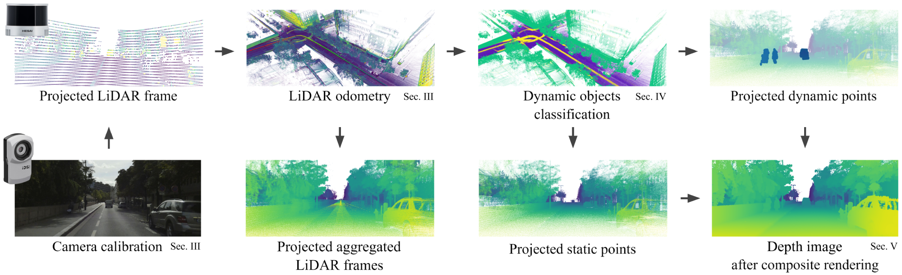

# DOC-Depth: A novel approach for dense depth ground truth generation
Official implementation of the DOC-Depth method. 

[Project Page](https://simondemoreau.github.io/DOC-Depth)

 

If you use our method in your research, please cite :
```bibtex
TBA
```

## Dense Depth KITTI annotations
Please visit our [project page](https://simondemoreau.github.io/DOC-Depth) to download the dense annotations of KITTI. 

## Calibration
The first step of the pipeline is to calibrate together LiDAR and Camera. See the [Calibration](Calibration) folder to use our tool.

## Recording
The easiest way to record your dataset is to use [ROS](https://ros.org/) to record all your sensors into ".bag" files.

## Preprocessing
After recording, you must use our pre-processing pipeline with SLAM and DOC to obtain a dense and classified reconstruction of your record. See the [Preprocessing](Preprocessing) folder for more informations. 

## Rendering
Finally, you can use our tool to apply our composite rendering to the classified LiDAR frames and obtain your dense depth. See the [Rendering](Rendering) folder to access our tool. 

## License 
TBA